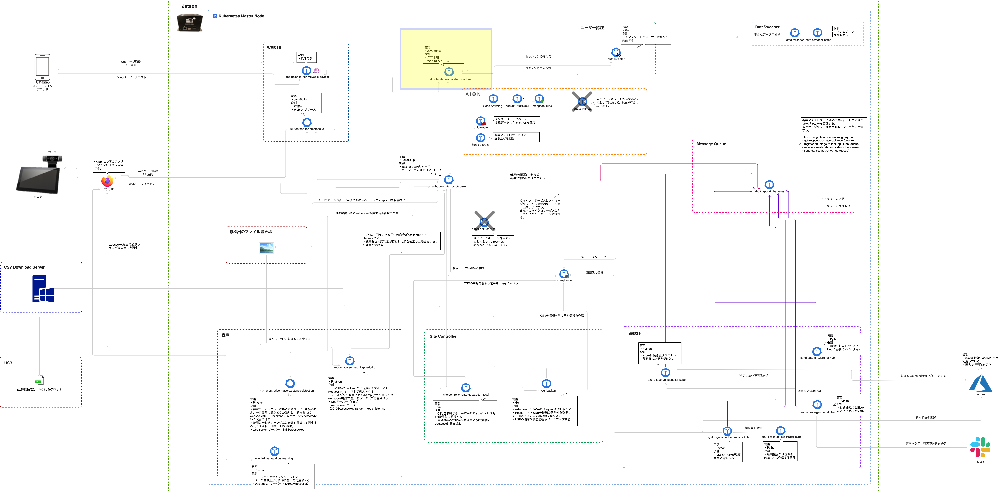
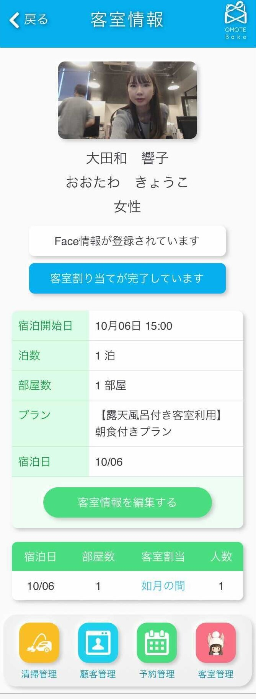

# ui-frontend-for-omotebako-mobile  
ui-frontend-for-omotebako-mobileは、Latonaが提供するエッジアプリケーション「OMOTE-Bako」のモバイル向けフロントエンドリソースです。   

## OMOTE-Bako のエッジコンピューティングアーキテクチャ  
ui-frontend-for-omotebako-mobileは、下記の黄色い枠の部分のリソースです。  

## UIの一例   
下記の画像は、ui-frontend-for-omotebako-mobileによる実際のUIの一例です。      

## ui-frontend-for-omotebakoの稼働環境   
・ ui-frontend-for-omotebako-mobileは、エッジ環境上で稼働します。    
・ ui-frontend-for-omotebako-mobileは、AIONならびに(または)Kubernetes上で稼働することができるマイクロサービスです。  
・ ui-frontend-for-omotebako-mobileは、Reactフレームワーク、Next.jsによって開発されています。  